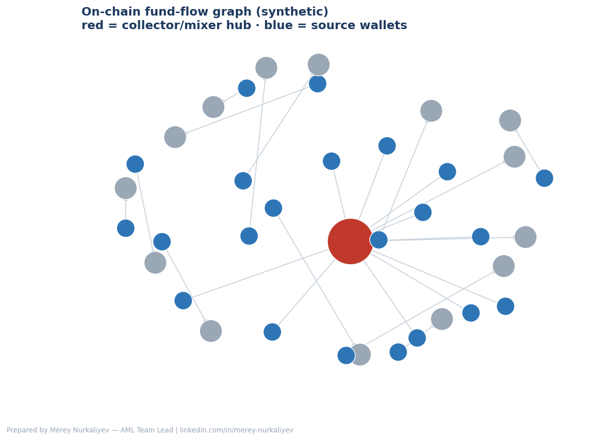

# RegTech Toolkit — AML × AI

A set of small, focused, **explainable** building blocks for crypto/VASP
compliance — the space between "black-box vendor" and "manual spreadsheet".
Each tool runs on **synthetic data**, is documented, and is designed to be
defensible to a regulator.

> ⚠️ **Synthetic / public-knowledge only.** No real customer, transaction, or
> employer data anywhere in this repository. These are portfolio demos, not
> production systems.

## Modules

| File | What it does |
|------|--------------|
| `risk_scoring.py` | Multivariate anomaly scoring (Mahalanobis) with an explainability layer — every score lists the features that drove it |
| `sanctions_screen.py` | Fuzzy name screening vs a watchlist (transliterations, name-order swaps, typos) |
| `fund_flow.py` | Directed-graph view of transfers; detects collector/mixer hubs and pass-through layering |
| `rulebook_retriever.py` | Retrieval layer of a RAG assistant over VARA/SFC/AIFC/FATF rule snippets |
| `sar_generator.py` | Drafts a SAR/STR narrative from alert flags (human-in-the-loop) |
| `kyc_calculator.html` | Single-file web KYC risk-rating calculator (no data stored) |



## Quick start
```bash
pip install -r requirements.txt        # pandas, numpy, networkx, matplotlib

python risk_scoring.py                  # -> ml_risk_scores.csv
python sanctions_screen.py             # -> screening_results.csv
python fund_flow.py                    # -> fund_flow_graph.png
python rulebook_retriever.py "travel rule"   # stdlib only
python sar_generator.py                # -> sar_draft.md (stdlib only)
# kyc_calculator.html — just open it in a browser
```

`sanctions_screen.py`, `rulebook_retriever.py` and `sar_generator.py` use only
the Python standard library.

## Design principles
1. **Explainable over clever** — every score/flag carries its reason.
2. **Rules first, ML second** — ML augments transparent logic, never replaces it.
3. **Human-in-the-loop** — tools draft and prioritise; people decide and file.
4. **Auditable & reproducible** — seeded synthetic data, no hidden state.

## Why this exists
Modern AML needs both regulatory judgment and the ability to build. This toolkit
shows the second half — applying automation and light ML to financial-crime
workflows while keeping everything an examiner could follow.

## License
MIT — see [LICENSE](LICENSE).

---
Built by **Merey Nurkaliyev** — AML Team Lead, crypto compliance, on-chain
investigations & RegTech. [linkedin.com/in/merey-nurkaliyev](https://www.linkedin.com/in/merey-nurkaliyev)
